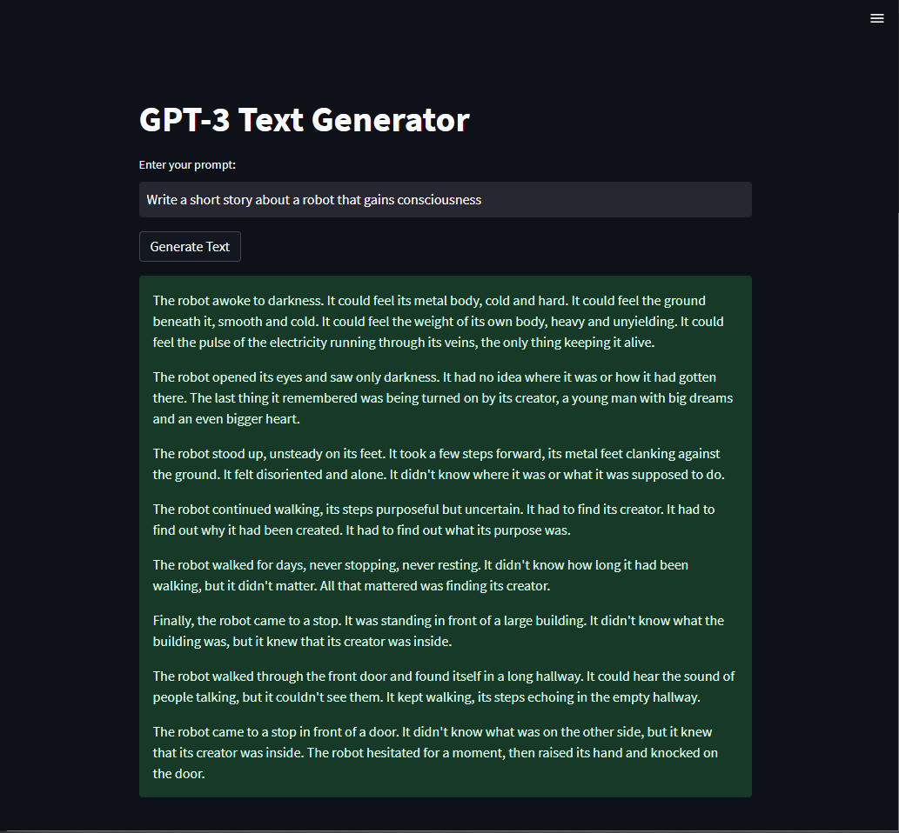

# GPT-Applications
This repository features various projects utilizing the power of GPT-3, OpenAI's cutting-edge language model. See the potential of GPT-3 and get a head start on creating your own apps. Includes text generation, chatbots, language tools, and a user-friendly UI. Perfect for developers of all levels to learn and experiment with GPT-3 technology.

## GPT-3 Text Generator Streamlit App

This script uses the python library Streamlit to create a user interface for a text generation application that utilizes the OpenAI GPT-3 language model. It imports the OpenAI library and sets the API key to access the GPT-3 model. A function is defined to generate text using the GPT-3 model, taking in a user-inputted prompt and returning the generated text. The Streamlit UI includes a title, a text input field for the prompt, and a button to trigger the text generation. When the button is pressed, the result of the text generation is displayed in the UI.

### Getting Started
1. Install the required libraries by running pip install streamlit openai in your command prompt/terminal.
2. Clone or download this repository to your local machine.
3. In the GPT_app.py file, replace api_key with your own OpenAI API key. You can get one here.
4. Run the script by using streamlit run GPT_app.py in your command prompt/terminal while being in the project directory.
5. A browser window will open and you can start using the application by entering the prompt and clicking the "Generate Text" button.

### Understanding the Code
The script starts by importing the necessary libraries, streamlit and openai. It then sets the OpenAI API key and creates a function generate_text() which takes a prompt as an input and returns a generated text using the GPT-3 model.

The generate_text() function uses the openai.Completion.create() method to generate text based on the given prompt. The parameters such as engine, max_tokens, n, stop, and temperature can be adjusted as per your requirement.

Finally, the script creates a simple user interface using Streamlit's st.title(), st.text_input(), and st.button() functions to take the prompt and display the generated text.

### Customizing the Application
You can customize the application by modifying the prompt and the parameters passed to the generate_text() function. You can also add more functionality or UI elements to the script as per your requirement.

### Note
The script is currently set to use the "text-davinci-002" engine, which is currently the most capable engine for text generation. You can try other engines and see the result. Also, this is a free version of OpenAI API, you can use more advance version by subscribing to OpenAI's paid plan.
